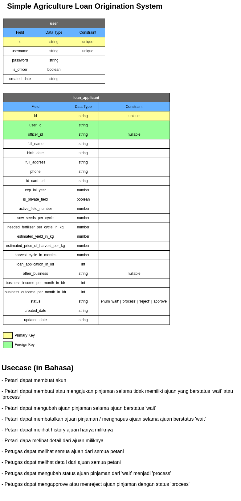

# ADeA (A**\* D**\*\*\***\* e**\*\*\*\* Assignment)

Repository for ADe Assignment Test

## Loan Origination System Overview

## Definition

### Loan Origination

Loan origination is the process by which a borrower applies for a new loan, and a lender processes that application. Origination generally includes all the steps from taking a loan application up to disbursal of funds (or declining the application). For mortgages, there is a specific mortgage origination process. Loan servicing covers everything after disbursing the funds until the loan is fully paid off. Loan origination is a specialized version of new account opening for financial services organizations. Certain people and organizations specialize in loan origination. Mortgage brokers and other mortgage originator companies serve as a prominent example [ref](https://en.wikipedia.org/wiki/Loan_origination)

### Loan Origination System

An LOS is defined as a system that automates and manages the end-to-end steps in the loan process – from the application, through underwriting, approval, documentation, pricing, funding, and administration [ref](https://abrigo.com/blog/loan-origination-system-los-what-is)

### Lead Generation

Lead generation is the process of gaining the interest of potential customers in order to increase future sales. It is a crucial part of the sales process of many companies. [ref](https://www.salesforce.com/ap/learning-centre/marketing/what-is-lead-generation/)

### Loan Application

A loan application is used by borrowers to apply for a loan. Through the loan application, borrowers reveal key details about their finances to the lender. The loan application is crucial to determining whether the lender will grant the request for funds or credit. [ref](https://bankrate.com/glossary/l/loan-application/)

### Loan Application

A loan application is used by borrowers to apply for a loan. Through the loan application, borrowers reveal key details about their finances to the lender. The loan application is crucial to determining whether the lender will grant the request for funds or credit. [ref](https://bankrate.com/glossary/l/loan-application/)

### Loan Appraisal Compliance

_There is no concrete definition of it I can find, but based on many sources I read the definition is self-explanatory by its name, so the loan application borrower sent will be reviewed by ***something*** before it gets approval._

### Loan Appraisal Approval

The definition is self-explanatory by its name, it means reviewed loan applicant will be approved or rejected based on loan appraisal compliance\_

### Customer On-Boarding

Client onboarding can be simply defined as the entire process through which a user starts his journey as a customer or a client of a bank/ financial institution. Similarly, the onboarding experience can be defined as the relationship between the customer and the organization. [ref](https://www.digipay.guru/blog/future-of-customer-onboarding-in-banks/)

## Study Case based on definition in K*B\*Y** (K\*\***B\*Y\*\* *\*\*\*\*)

Based on 4 stories on _the website_

- **Lead Generation**, is where sales approach the future customer, but it also could be in form of other content that makes people interested in the product or service.
- **Loan Application**, is where future customers apply for the loan through the KBY system.
- **Loan Appraisal Compliance**, is where future customer applications is assessed.
- **Loan Appraisal Approval**, is where future customer application approved.
- **Customer On-Boarding**, is where the future customers already becomes service or product customers and they get their service or product.

## Implementation

### ERD

